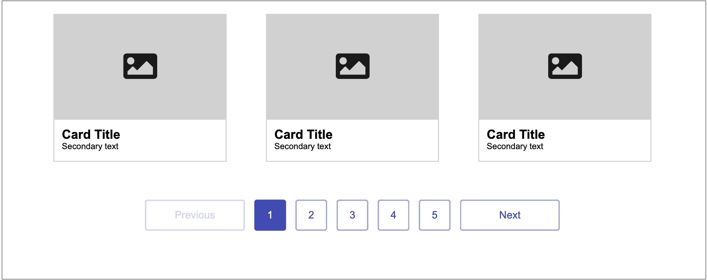
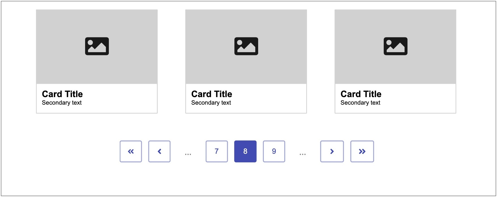

<!-- MM: Thanks, Kristin. I like the topic and I like the post. I just have the feeling that you haven't tested both solutions properly with different screen readers. Testing with VO on desktop isn't enough. Generelly, the results it gives differ a lot from NVDA and JAWS and it's far from being the most used SR: https://webaim.org/projects/screenreadersurvey10/#browsercombos
Please test with other software and adapt the code and descriptions accordingly.  -->

<!-- SS: I really like the topic of the post, but I think the amount of aria- usage in the example code needs/can be reduced. I think MM and KS have already pointed out the detailed changes necessary in the example codes. -->

Imagine you’re reading a book that seems perfect for cozy winter evenings. But as soon as you turn the page, you suddenly find yourself somewhere else, rather than on the next page of the story. Now, you have to painstakingly search through the book to find where the story continues — as if someone had bound the pages in the wrong order.
Would you keep reading? Or recommend the book to others?

For about [16% of the world’s population](https://www.who.int/news-room/fact-sheets/detail/disability-and-health#:~:text=Key%20facts,1%20in%206%20of%20us.) (roughly the population of China), the web often feels like a maze. People who rely on assistive technologies experience the web like a poorly bound book, one they must tediously navigate page by page rather than simply moving to the next relevant section.

Another example: imagine you’re searching on Google and find the answer on page 2. However, to get there, you first need to enter the [Konami Code](https://de.wikipedia.org/wiki/Konami-Code) to unlock the link. Such hidden navigation elements are, unfortunately, a daily reality for many web users.
<!-- MM: What exactly do you mean by "hidden navigation". Can you give me an actual example? because SERPs on google are accessible, right? -->

While accessible paginations don’t make the entire web accessible, it does ensure that everyone, whether reading a book or browsing the web, can seamlessly turn from page to page and easily find the next part of the story.

## Pagination I

Let’s start with a simple example — a pagination that’s perfect for small websites, such as blogs or product listings.



```html
<nav aria-label="Pagination of product listings">
  <ul>
    <li>
      <a aria-disabled="true" aria-label="Previous Page">Previous</a>
    </li>
    <li>
      <a href="#" aria-label="Page 1" aria-current="page">1</a>
    </li>
    <li>
      <a href="/2/" aria-label="Page 2">2</a>
    </li>
    <li>
      <a href="/3/" aria-label="Page 3">3</a>
    </li>
    <li>
      <a href="/4/" aria-label="Page 4">4</a>
    </li>
    <li>
      <a href="/5/" aria-label="Page 5">5</a>
    </li>
    <li>
      <a href="/2/" aria-label="Next Page, Page 2">Next</a>
    </li>
  </ul>
</nav>
```

* **Clear Page Structure**: The `<nav>` element with an aria-label provides orientation for screen reader users and makes the [page structure](https://www.htmhell.dev/tips/landmarks/) immediately recognizable. If `<nav>` cannot be used, the root element of the pagination should be given `role="navigation"` to ensure assistive technologies interpret the navigation correctly. Distinct `aria-labels` (e.g., "Pagination of product listings" and "Menu") help differentiate between navigational elements.
<!-- MM: Is there a reason you prefer "Pagination of product listings" over something like "More results"? "Pagination" sounds so technical. -->
* **Use of `<ul>` for Flexibility**: The `<ul>` element displays pages as equal, freely selectable links, without implying a strict sequence as an `<ol>` would. This approach aligns with non-linear pagination and avoids confusion for screen reader users.
<!-- MM: That doesn't really make sense to me. The links are in the context of the pagination in a strict order (page 1, page 2, page 3,..). How would using an ol confuse screen reader users? -->
* **Clear Link Descriptions**: `aria-label` attributes on links (e.g., "Back, Page 1", "Next Page, Page 2" or "Page 1") provide screen reader users with clear information on each link’s function. Hearing "Page 1" is more understandable than just the number "1."
<!-- MM: But technically it fails 2.5.3, no? https://www.w3.org/WAI/WCAG22/quickref/?showtechniques=253#label-in-name -->
* **Intuitive Navigation**: The `aria-current="page"` attribute marks the current page and is read by VoiceOver on macOS as "Current page, Link, Page 1" providing screen reader users with a clear indication of which page they are on.
<!-- MM: Can you please use a more general phrasing instead of mentioning VO explicitly? Readers may think that it only works in VO. -->
* **Proper Deactivation**: A disabled link, such as "Back" on the first page, should have no href attribute and should be marked with `aria-disabled="true"` to ensure accessibility. Alternatively, a `<span>` element can be used in place of a link element with the aria-disabled attribute.
<!-- MM: What does "ensure accessibility" mean? Why do you remove href and combine it with aria-disabled? Why not use disabled? -->

## Pagination II

Let’s look at a pagination system that’s particularly suited for large websites like online shops or blogs. This enhanced pagination allows users to skip large blocks of pages while maintaining a clear structure.

This pagination builds on the principles of the simple pagination. The same recommendations for using `<nav>`, `<ul>`, `aria-label`, `aria-current`, and `aria-disabled` apply here as well.



```html
<nav aria-label="Pagination of product listings">
  <ul>
    <li>
      <a href="/1/" aria-label="First Page">
        <svg xmlns="http://www.w3.org/2000/svg" width="16" height="16" aria-hidden="true" focusable="false" viewBox="0 0 24 24">
          <path d="M14 18l-6-6 6-6L12.59 4 6.59 10 12.59 16 14 18z"/>
          <path d="M20 18l-6-6 6-6L18.59 4 12.59 10 18.59 16 20 18z" />
        </svg>
      </a>
    </li>
    <li>
      <a href="/7/" aria-label="Previous Page, Page 7">
        
      </a>
    </li>
    <li>
      <span aria-disabled="true" aria-label="skipping Pages 2 to 6">...</span>
    </li>
    <li>
      <a href="/7/" aria-label="Page 7">7</a>
    </li>
    <li>
      <a href="#" aria-label="Page 8" aria-current="page">8</a>
    </li>
    <li>
      <a href="/9/" aria-label="Page 9">9</a>
    </li>
    <li>
      <span aria-disabled="true" aria-label="skipping Pages 10 to 12">...</span>
    </li>
    <li>
      <a href="/9/" aria-label="Next Page, Page 9">
        
      </a>
    </li>
    <li>
      <a href="/12/" aria-label="Last Page, Page 12">
        <svg xmlns="http://www.w3.org/2000/svg" width="16" height="16" aria-hidden="true" focusable="false" viewBox="0 0 24 24">
          <path d="M10 6l6 6-6 6 1.41 1.41L18.41 12 11.41 4.59 10 6z" />
          <path d="M4 6l6 6-6 6 1.41 1.41L12.41 12 5.41 4.59 4 6z" />
        </svg>
      </a>
    </li>
  </ul>
</nav>
```

**Use of Images and Icons**:

* To prevent symbols from being redundantly read aloud by screen readers, SVGs and images are given `aria-hidden="true"`. The link functionality is described exclusively via the aria-label in the `<a>` tag (e.g., "Next Page"), ensuring a clear and precise output for screen readers.
<!-- MM: Why aria-label and not visually hidden text? -->
<!-- KS: This is my primary question throughout this post. Text content
     of `<a>` elements is very well understood as an accessible name,
     and should be preferred over aria- attributes. -->
* The alt attribute for images remains empty (`alt=""`) to prevent purely visual images from being unnecessarily read aloud. Since the link’s functionality is already described by the `aria-label`, this avoids redundant information for screen reader users.
<!-- MM: But instead of the aria-label you could use the alt, no? Why is aria-label better? -->
<!-- MM: Why the extra aria-hidden=true in the code example? -->
* SVG icons also include the `focusable="false"` attribute to prevent them from being focusable in keyboard navigation. This attribute is unnecessary for images, as they are automatically excluded from keyboard focus.
<!-- MM: Do you know if there's a browser or a situation where this is still the case? Afaik SVGs only use to be focusable in IE 11. -->

**Skipping Multiple Pages**:

* Screen readers in reading mode will also announce `<span>` elements. The `aria-label` (e.g., "skipping Pages 2 to 6") provides information on the skipped pages, as the simple "…" symbol alone would not be meaningful enough for screen readers.
<!-- MM: aria-disabled is not supposed be used with generic elements: https://www.w3.org/TR/wai-aria/#aria-disabled -->
<!-- MM: aria-label is not allowed on generic elements: https://www.w3.org/TR/html-aria/#docconformance-naming -->
* Instead of requiring users to go through unnecessary page numbers, `aria-disabled` groups the inactive, skipped pages as a single unit, keeping the navigation structure clear and efficient.
<!-- MM: NVDA ignores the span entirely and just announces an empty bullet -->

## The final chapter

Accessible pagination is more than just a design detail—it provides orientation, simplifies navigation, and greatly improves the user experience, especially for those relying on assistive technologies.

The ARIA attributes and semantic HTML elements presented here create an accessible structure that remains easy to use across all devices, from desktop to smartphone.

Accessible pagination ensures that all users can navigate the web without "getting lost as if reading a book with pages bound out of order."  This makes the web not only more inclusive but also more accessible for everyone looking to find content efficiently and directly.
